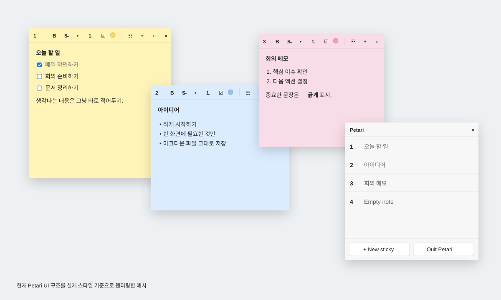

# Petari

**바탕화면에 붙여두는 가벼운 Markdown 스티키 노트.**

Petari는 여러 프로젝트의 할 일과 메모를 Sticky Notes처럼 화면에 바로 띄워두기 위한 Windows 데스크탑 앱입니다.

복잡한 프로젝트 관리 기능보다 **빠르게 띄우고, 바로 적고, 계속 보이는 것**에 집중합니다. 각 메모는 평범한 `.md` 파일이며 별도의 데이터베이스나 전용 문서 포맷을 사용하지 않습니다.



> 현재 Petari UI 구조와 실제 스타일을 기준으로 렌더링한 미리보기입니다.

## 실행

```text
git pull
→ Petari.exe 더블클릭
```

`Petari.exe`는 저장소 루트에 포함되어 있습니다. 소스 코드가 변경되면 GitHub Actions가 Windows 실행 파일을 다시 빌드해 자동으로 갱신합니다.

처음 실행하면 첫 메모가 자동으로 만들어집니다. 이후 `+`를 누르면 저장 위치나 파일명을 묻지 않고 새 메모가 즉시 생성됩니다.

## 사용 방식

메모 하나가 곧 Markdown 파일 하나입니다.

```text
Documents/Petari/
├─ 1.md
├─ 2.md
└─ 3.md
```

파일명과 저장 경로는 내부 구현에만 사용합니다. 앱에서는 `1`, `2`, `3`처럼 메모 번호만 보여줍니다.

각 파일의 본문에는 Markdown을 저장하고, 창 위치·크기·색상 같은 Petari 전용 상태는 YAML frontmatter의 `petari` namespace에 저장합니다.

```md
---
petari:
  x: 420
  y: 180
  width: 320
  height: 260
  alwaysOnTop: false
  color: yellow
  open: true
---

- [ ] 확인할 일
- **중요한 내용**
- ~~완료한 내용~~
```

따라서 Petari가 없어도 VS Code, Obsidian 등 일반 Markdown 편집기에서 그대로 열 수 있습니다.

## 현재 기능

- 실행 시 이전에 열려 있던 메모 창 자동 복원
- `+`로 새 메모 즉시 생성
- 현재 메모 기준으로 살짝 어긋나게 새 창 배치
- WYSIWYG Markdown 편집
- Bold / Strikethrough
- Bullet list / Numbered list
- Checklist (`- [ ]`, `- [x]`)
- 기본 편집 단축키와 Undo / Redo
- 5가지 메모 색상
- 창 이동 / 크기 조절 및 자동 저장
- Always on top
- 좁은 창에서는 보조 버튼을 숨기고 `+`, `×` 유지
- 메모 목록 창에서 전체 메모 확인 및 다시 열기
- `Quit Petari`로 모든 창을 한 번에 종료

## 창 상태 복원

개별 메모의 `×`를 누르면 해당 파일의 `petari.open`이 `false`가 됩니다.

반대로 `Quit Petari`로 프로그램 전체를 종료할 때는 각 메모의 `open` 상태를 유지합니다. 다음 실행 시 `open: true`인 메모들을 이전 위치와 크기로 다시 띄웁니다.

## 구조

```text
                         PETARI
                            │
              ┌─────────────┴─────────────┐
              │                           │
         Tauri 2 / Rust              React + Vite
              │                           │
       native window / fs            WYSIWYG editor
              │                           │
              └─────────────┬─────────────┘
                            │
                       Markdown file
                            │
                 content + petari state
```

```text
1 .md file = 1 sticky = 1 desktop window
```

별도의 서버, 데이터베이스, 백그라운드 동기화 서비스 없이 로컬 Markdown 파일만 source of truth로 사용합니다.

## 기술 스택

- Tauri 2
- React + TypeScript
- Vite
- Tiptap
- Markdown + YAML frontmatter

## 방향

> 필요한 것을 화면에 붙여두고, 보고, 바로 고친다.

Petari는 Notion, Trello, Jira 같은 프로젝트 관리 도구를 대체하려는 앱이 아닙니다. Markdown 파일의 개방성과 Sticky Notes의 즉시성을 결합한 작은 데스크탑 도구를 목표로 합니다.
